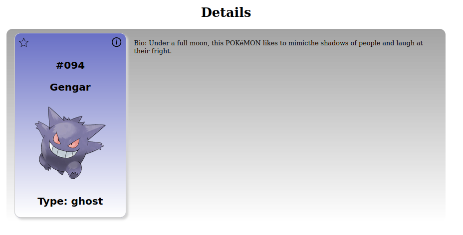

# React-Challenge

3rd party API:
CSS Framework:

## W1D1
- [x] React Class Component
- [x] Local State
- [x] Props
- [x] Handling Event
- [x] 3rd Party API & lifecycle
- web preview:

### Comments

## W1D2
Target
- [x] useState
- [x] useEffect
- [?] Custom hooks
- [x] Functional Component
- [x] Event Handling
- web preview:

### Comment

## W1D3
- [x] Add to favourites
- [x] Reducer
- [x] Store
- [x] Action
- [x] Router

### Comment

### COMPLETED FEATURE LIST
- [x] favorites
- [x] details
- [x] pagination
- [x] thunk middleware
- [x] combine reducer
- [x] debouncing search

### Deploy URL
https://pokedexdharma.web.app/

### FINAL LOOK

